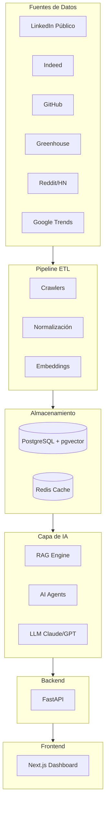

# LinkedIn Intelligence

> **AI-powered job application agent** — Personaliza tu CV por oferta, analiza el match req-by-req, completa formularios ATS con evidencia verificable y te deja revisar antes de enviar.

**Producción**: [Frontend](https://frontend-v2-production-a1c0.up.railway.app) · [API](https://api-production-fd73.up.railway.app/health)

[](https://www.python.org/)
[](https://fastapi.tiangolo.com/)
[](https://www.postgresql.org/)
[](./LICENSE)
[]()

---

## ¿Qué es LinkedIn Intelligence?

LinkedIn Intelligence es una plataforma de aplicación inteligente a empleos que:

- **Personaliza tu CV** por oferta con bullets adaptados y trazabilidad de evidencia
- **Analiza el match** req-by-req (MATCHED / PARTIAL / MISSING / BLOCKER)
- **Completa formularios ATS** (Greenhouse, Lever, Workday y más) con revisión humana obligatoria
- **Genera estrategia de aplicación** (keywords, narrativa, claims a evitar)
- **Aprende de outcomes** con calibración y experimentos A/B

El roadmap original (Skills Radar, Benchmark, AI About Writer) queda planificado para v1.1+.

---

## Características v1.0 (disponibles)

| Feature | Descripción | Estado |
|---------|-------------|--------|
| **CV Engine** | Bullets personalizados por JD con evidence refs | ✅ |
| **Matching 3.0** | Score ponderado + hard constraints + BLOCKER | ✅ |
| **Application Agent** | Form fill + state machine + human confirm gate | ✅ |
| **ATS Adapters** | Greenhouse, Lever, Workday, Ashby, SmartRecruiters | ✅ |
| **Application Control Center** | Diff CV, strategy panel, pre-submit review | ✅ |
| **Evidence System** | Validación SUPPORTED / PLAUSIBLE / CONTRADICTED | ✅ |

## Roadmap futuro (v1.1+)

| Feature | Descripción | Fase |
|---------|-------------|------|
| **Skills Radar** | Top skills por rol en tiempo real | 2 |
| **Profile Benchmark** | Comparación contra perfiles top | 2 |
| **AI About Writer** | Reescritura automática del About | 3 |
| **Content Calendar** | Generador de publicaciones LinkedIn | 3 |
| **Job Tracker** | Seguimiento de ofertas y fit | 4 |
| **AI Radar** | Tendencias nocturnas de mercado | 5 |

<!--
Legacy feature table (pre-v1 pivot):
| **CV Analyzer** | Puntaje ATS + keywords faltantes | 1 |
| **Profile Optimizer** | Recomendaciones para título, About y skills | 1 |
-->

---

## Arquitectura de alto nivel



---

## Stack tecnológico

| Capa | Tecnología |
|------|-----------|
| Backend | FastAPI · Python 3.11 |
| Base de datos | PostgreSQL 16 · pgvector |
| Cache | Redis |
| AI/LLM | LangChain · LangGraph · Claude · OpenAI |
| Embeddings | sentence-transformers · OpenAI Ada |
| Frontend | Next.js 15 · TypeScript · Tailwind CSS |
| Infraestructura | Docker · Railway (prod) · GitHub Actions |
| CI/CD | GitHub Actions |

---

## Quick Start (desarrollo local)

```bash
# 1. Clonar el repositorio
git clone https://github.com/sirjabo/linkedin-intelligence.git
cd linkedin-intelligence

# 2. Copiar variables de entorno
cp .env.example .env
# Editar .env con tus API keys

# 3. Levantar servicios
docker compose up -d

# 4. Instalar dependencias del backend
cd backend
pip install -r requirements.txt

# 5. Correr migraciones
alembic upgrade head

# 6. Iniciar la API
uvicorn app.main:app --reload

# 7. Frontend
cd ../frontend
npm install && npm run dev
```

La API queda disponible en `http://localhost:8000` y el dashboard en `http://localhost:3000`.

Asegurate de setear `NEXT_PUBLIC_API_URL=http://localhost:8000` en `.env` (sin sufijo `/api/v*`).

---

## Estructura del repositorio

```
linkedin-intelligence/
├── docs/               # Documentación técnica y de producto
├── agents/             # Instrucciones para Claude Code, Cursor y ChatGPT
├── tasks/              # Sprints y backlog de tareas
├── backend/            # API FastAPI
├── frontend/           # Dashboard Next.js
├── crawler/            # Scrapers y extractores de datos
├── etl/                # Pipeline de procesamiento
├── infra/              # Docker, Terraform, GitHub Actions
└── .github/            # Templates de issues, PRs y Copilot
```

---

## Documentación

| Documento | Descripción |
|-----------|-------------|
| [VISION](./docs/00-VISION.md) | Problema, misión y métricas de éxito |
| [PRD](./docs/01-PRD.md) | Requerimientos de producto |
| [ROADMAP](./docs/02-ROADMAP.md) | Plan de 12 meses |
| [ARCHITECTURE](./docs/03-ARCHITECTURE.md) | Arquitectura del sistema |
| [TECH STACK](./docs/04-TECH_STACK.md) | Stack y decisiones tecnológicas |
| [DATA SOURCES](./docs/05-DATA_SOURCES.md) | Fuentes de datos y estrategia |
| [DATABASE](./docs/06-DATABASE.md) | Esquema y modelo de datos |
| [API SPEC](./docs/07-API_SPEC.md) | Endpoints y contratos de la API |
| [CRAWLERS](./docs/08-CRAWLERS.md) | Arquitectura de scrapers |
| [ATS ENGINE](./docs/09-ATS_ENGINE.md) | Motor de scoring ATS |
| [LINKEDIN ENGINE](./docs/10-LINKEDIN_ENGINE.md) | Motor de optimización de perfil |
| [RAG](./docs/11-RAG.md) | Arquitectura de Retrieval-Augmented Generation |
| [AI AGENTS](./docs/12-AI_AGENTS.md) | Agentes de IA con LangGraph |
| [SECURITY](./docs/13-SECURITY.md) | Seguridad y privacidad |
| [DEPLOYMENT](./docs/14-DEPLOYMENT.md) | Despliegue en producción |
| [OBSERVABILITY](./docs/15-OBSERVABILITY.md) | Logs, métricas y alertas |
| [TESTING](./docs/16-TESTING.md) | Estrategia de testing |
| [CODING STANDARDS](./docs/17-CODING_STANDARDS.md) | Estándares de código |
| [DECISIONS](./docs/19-DECISIONS.md) | Architecture Decision Records |
| [BACKLOG](./docs/20-BACKLOG.md) | Backlog de producto |

---

## Agentes de IA

Este proyecto usa tres asistentes de IA con roles diferenciados:

- **[Claude Code](./agents/CLAUDE.md)** — Arquitectura, planificación y coordinación
- **[Cursor](./agents/CURSOR.md)** — Programación y refactoring
- **[ChatGPT](./agents/CHATGPT.md)** — Diseño de producto y documentación
- **[Workflow](./agents/WORKFLOW.md)** — Cómo coordinan los tres

---

## Licencia

MIT — ver [LICENSE](./LICENSE)

---

* v1.0 en producción — ver [RELEASE_V1_VALIDATION](./docs/RELEASE_V1_VALIDATION.md) y [AGENTS.md](./AGENTS.md).
