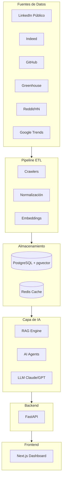

# LinkedIn Intelligence

> **AI-powered LinkedIn profile optimizer** — Análisis de millones de ofertas laborales, perfiles públicos y tendencias de mercado para ayudarte a conseguir el trabajo que querés.

[](https://www.python.org/)
[](https://fastapi.tiangolo.com/)
[](https://www.postgresql.org/)
[](./LICENSE)
[]()

---

## ¿Qué es LinkedIn Intelligence?

LinkedIn Intelligence es una plataforma que analiza el mercado laboral en tiempo real para responder preguntas concretas:

- **¿Qué skills necesito para ser AI Engineer en 2025?**
- **¿Cómo está redactado el "About" de quienes trabajan en Anthropic, OpenAI o Mercado Libre?**
- **¿Qué tecnologías crecieron más en los últimos 3 meses en las ofertas de Data Engineer?**
- **¿Qué le falta a mi perfil para aparecer en las búsquedas de recruiters?**

El sistema ingesta miles de ofertas de trabajo, analiza perfiles públicos, detecta tendencias y genera recomendaciones personalizadas accionables.

---

## Características principales

| Feature | Descripción | Fase |
|---------|-------------|------|
| **CV Analyzer** | Puntaje ATS + keywords faltantes | 1 |
| **Profile Optimizer** | Recomendaciones para título, About y skills | 1 |
| **Skills Radar** | Top 50 skills por rol en tiempo real | 1 |
| **Profile Benchmark** | Comparación contra perfiles top | 2 |
| **Keyword Gap** | Palabras clave que faltan vs. las mejores ofertas | 2 |
| **AI About Writer** | Reescritura automática del About con LLM | 3 |
| **Content Calendar** | Generador de publicaciones para LinkedIn | 3 |
| **Job Tracker** | Seguimiento de ofertas y fit del perfil | 4 |
| **AI Radar** | Tendencias nocturnas: tecnologías que crecen | 5 |

---

## Arquitectura de alto nivel



---

## Stack tecnológico

| Capa | Tecnología |
|------|-----------|
| Backend | FastAPI · Python 3.11 |
| Base de datos | PostgreSQL 16 · pgvector |
| Cache | Redis |
| AI/LLM | LangChain · LangGraph · Claude · OpenAI |
| Embeddings | sentence-transformers · OpenAI Ada |
| Frontend | Next.js 14 · TypeScript · Tailwind CSS |
| Crawlers | Python · Playwright · BeautifulSoup |
| Orquestación | n8n |
| Infraestructura | Docker · Docker Compose · AWS |
| CI/CD | GitHub Actions |

---

## Quick Start (desarrollo local)

```bash
# 1. Clonar el repositorio
git clone https://github.com/sirjabo/linkedin-intelligence.git
cd linkedin-intelligence

# 2. Copiar variables de entorno
cp .env.example .env
# Editar .env con tus API keys

# 3. Levantar servicios
docker compose up -d

# 4. Instalar dependencias del backend
cd backend
pip install -r requirements.txt

# 5. Correr migraciones
alembic upgrade head

# 6. Iniciar la API
uvicorn app.main:app --reload

# 7. Frontend
cd ../frontend
npm install && npm run dev
```

La API queda disponible en `http://localhost:8000` y el dashboard en `http://localhost:3000`.

---

## Estructura del repositorio

```
linkedin-intelligence/
├── docs/               # Documentación técnica y de producto
├── agents/             # Instrucciones para Claude Code, Cursor y ChatGPT
├── tasks/              # Sprints y backlog de tareas
├── backend/            # API FastAPI
├── frontend/           # Dashboard Next.js
├── crawler/            # Scrapers y extractores de datos
├── etl/                # Pipeline de procesamiento
├── infra/              # Docker, Terraform, GitHub Actions
└── .github/            # Templates de issues, PRs y Copilot
```

---

## Documentación

| Documento | Descripción |
|-----------|-------------|
| [VISION](./docs/00-VISION.md) | Problema, misión y métricas de éxito |
| [PRD](./docs/01-PRD.md) | Requerimientos de producto |
| [ROADMAP](./docs/02-ROADMAP.md) | Plan de 12 meses |
| [ARCHITECTURE](./docs/03-ARCHITECTURE.md) | Arquitectura del sistema |
| [TECH STACK](./docs/04-TECH_STACK.md) | Stack y decisiones tecnológicas |
| [DATA SOURCES](./docs/05-DATA_SOURCES.md) | Fuentes de datos y estrategia |
| [DATABASE](./docs/06-DATABASE.md) | Esquema y modelo de datos |
| [API SPEC](./docs/07-API_SPEC.md) | Endpoints y contratos de la API |
| [CRAWLERS](./docs/08-CRAWLERS.md) | Arquitectura de scrapers |
| [ATS ENGINE](./docs/09-ATS_ENGINE.md) | Motor de scoring ATS |
| [LINKEDIN ENGINE](./docs/10-LINKEDIN_ENGINE.md) | Motor de optimización de perfil |
| [RAG](./docs/11-RAG.md) | Arquitectura de Retrieval-Augmented Generation |
| [AI AGENTS](./docs/12-AI_AGENTS.md) | Agentes de IA con LangGraph |
| [SECURITY](./docs/13-SECURITY.md) | Seguridad y privacidad |
| [DEPLOYMENT](./docs/14-DEPLOYMENT.md) | Despliegue en producción |
| [OBSERVABILITY](./docs/15-OBSERVABILITY.md) | Logs, métricas y alertas |
| [TESTING](./docs/16-TESTING.md) | Estrategia de testing |
| [CODING STANDARDS](./docs/17-CODING_STANDARDS.md) | Estándares de código |
| [DECISIONS](./docs/19-DECISIONS.md) | Architecture Decision Records |
| [BACKLOG](./docs/20-BACKLOG.md) | Backlog de producto |

---

## Agentes de IA

Este proyecto usa tres asistentes de IA con roles diferenciados:

- **[Claude Code](./agents/CLAUDE.md)** — Arquitectura, planificación y coordinación
- **[Cursor](./agents/CURSOR.md)** — Programación y refactoring
- **[ChatGPT](./agents/CHATGPT.md)** — Diseño de producto y documentación
- **[Workflow](./agents/WORKFLOW.md)** — Cómo coordinan los tres

---

## Licencia

MIT — ver [LICENSE](./LICENSE)

---

*Proyecto en desarrollo activo. Parte del portfolio de AI Engineering de [@sirjabo](https://github.com/sirjabo).*
