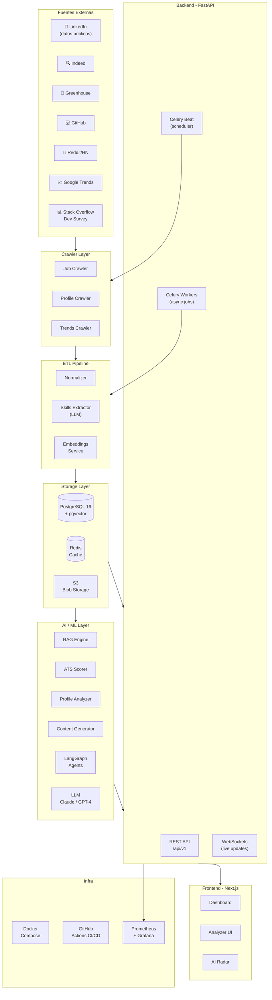
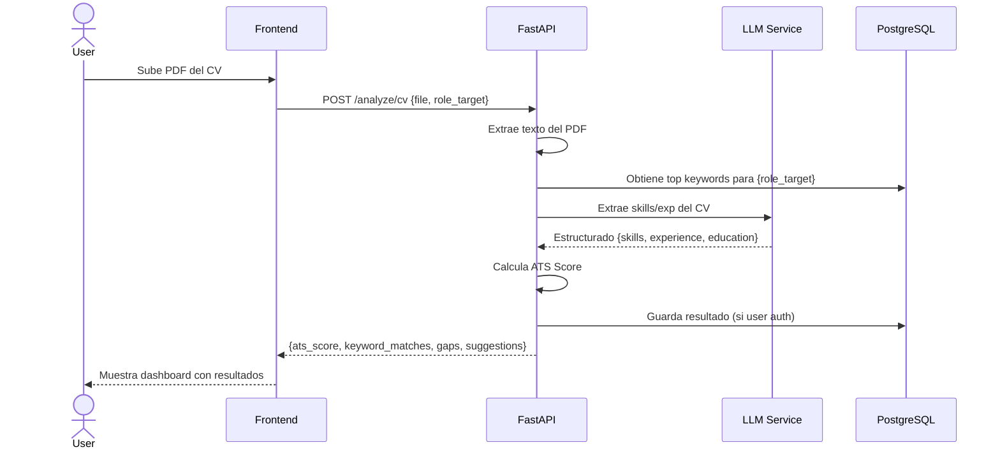
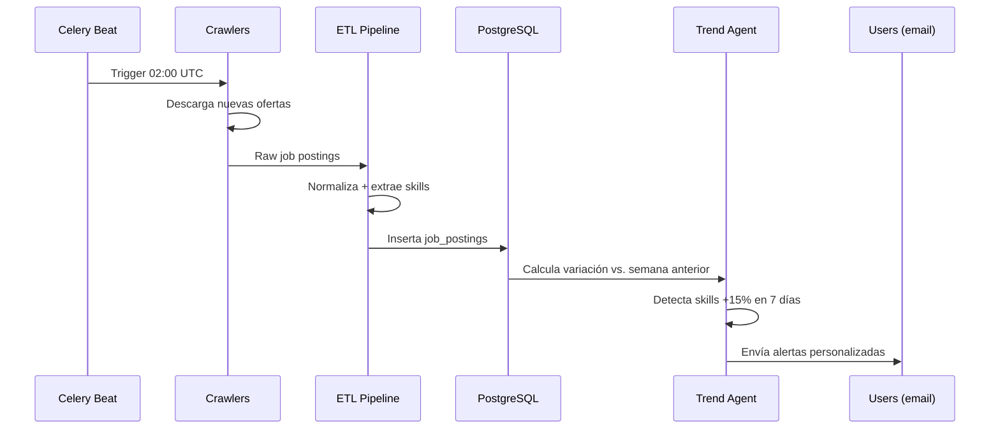

# 03 · Arquitectura del Sistema

## Visión general

LinkedIn Intelligence sigue una arquitectura de microservicios ligera, diseñada para evolucionar desde un monolito modular (Fase 1) hacia servicios separados (Fase 4+). El principio guía es: **no añadir complejidad hasta que el problema lo requiera**.

---

## Diagrama de arquitectura



---

## Componentes principales

### 1. Crawler Layer

Responsable de obtener datos de fuentes externas.

| Crawler | Fuente | Frecuencia | Output |
|---------|--------|-----------|--------|
| `JobCrawler` | Indeed, Greenhouse, Lever | Cada 6 horas | job_postings |
| `ProfileCrawler` | LinkedIn público | Diario | profile_snapshots |
| `TrendsCrawler` | Google Trends, Reddit, HN | Diario | trend_signals |
| `SurveyCrawler` | Stack Overflow Dev Survey | Mensual | survey_data |

**Principios**:
- Rate limiting estricto (respeta `robots.txt`)
- User-agent identificado y honesto
- Exponential backoff en errores
- Solo datos públicamente accesibles

### 2. ETL Pipeline

Transforma los datos crudos en información estructurada.

```
Raw Data
   │
   ▼
Normalizer          → Limpieza, deduplicación, formato estándar
   │
   ▼
Skills Extractor    → LLM extrae skills + tecnologías de texto libre
   │
   ▼
Embeddings Service  → Vectoriza perfiles y ofertas para similarity search
   │
   ▼
PostgreSQL + pgvector
```

### 3. Storage Layer

#### PostgreSQL 16 + pgvector
Base de datos principal. Almacena:
- Ofertas de trabajo normalizadas
- Snapshots de perfiles
- Skills y categorías
- Vectores de embeddings (pgvector)
- Datos de usuarios
- Análisis y reportes generados

#### Redis
- Cache de resultados de análisis (TTL 1 hora)
- Rate limiting de la API
- Cola de tareas Celery
- Sessions de usuario

#### S3 (o equivalente)
- CVs cargados por usuarios (si el usuario da opt-in)
- Reportes generados en PDF
- Logs archivados

### 4. AI / ML Layer

#### RAG Engine
Recupera contexto relevante (mejores perfiles, ofertas similares) y lo usa para generar respuestas con LLM.

```
Query del usuario
      │
      ▼
Embedding de la query
      │
      ▼
Similarity search en pgvector
      │
      ▼
Top-K documentos relevantes
      │
      ▼
LLM (Claude / GPT-4) + contexto
      │
      ▼
Respuesta accionable
```

#### ATS Scorer
Algoritmo híbrido:
1. Extracción de keywords del rol objetivo desde la DB
2. Matching exacto + matching semántico
3. Ponderación por frecuencia de aparición en ofertas reales
4. Score normalizado 0-100

#### LangGraph Agents
Agentes con herramientas para tareas complejas:
- `ProfileAnalystAgent`: analiza perfil completo
- `CVOptimizerAgent`: optimiza CV para una oferta específica
- `TrendAnalystAgent`: interpreta señales de tendencias del mercado
- `ContentCreatorAgent`: genera posts y calendario de contenido

### 5. Backend — FastAPI

```
/api/v1/
├── /analyze
│   ├── POST /cv
│   └── POST /linkedin
├── /market
│   ├── GET /skills/{role}
│   ├── GET /trends
│   └── GET /companies
├── /optimize
│   ├── POST /title
│   ├── POST /about
│   └── POST /cv-for-job
├── /generate
│   ├── POST /about
│   ├── POST /post
│   └── POST /calendar
├── /jobs
│   ├── GET /
│   ├── POST /
│   └── GET /{id}/fit
└── /radar
    └── GET /daily
```

### 6. Frontend — Next.js 14

- App Router con Server Components
- Tailwind CSS + shadcn/ui
- Zustand para estado global
- React Query para data fetching
- Recharts para visualizaciones

---

## Flujos principales

### Flujo: Análisis de CV



### Flujo: Nightly Radar



---

## Decisiones arquitectónicas

Ver [19-DECISIONS.md](./19-DECISIONS.md) para el historial completo de ADRs.

| ADR | Decisión |
|-----|---------|
| ADR-001 | PostgreSQL + pgvector sobre Qdrant/Pinecone |
| ADR-002 | FastAPI sobre Django/Flask |
| ADR-003 | Next.js App Router sobre CRA/Vite |
| ADR-004 | Celery sobre RQ/Airflow para el MVP |
| ADR-005 | Claude como LLM primario con fallback a GPT-4 |

---

## Consideraciones de escalabilidad

### Fase 1 (MVP)
- Todo en un solo servidor (Docker Compose)
- PostgreSQL + pgvector en la misma instancia
- API y workers en procesos separados

### Fase 3+
- Separar crawlers en workers independientes
- Read replicas para PostgreSQL
- CDN para assets del frontend

### Fase 5 (AI Radar)
- Vector DB dedicado si pgvector llega a su límite
- Message queue (Kafka/SQS) para el pipeline de datos
- Autoscaling de workers según carga
